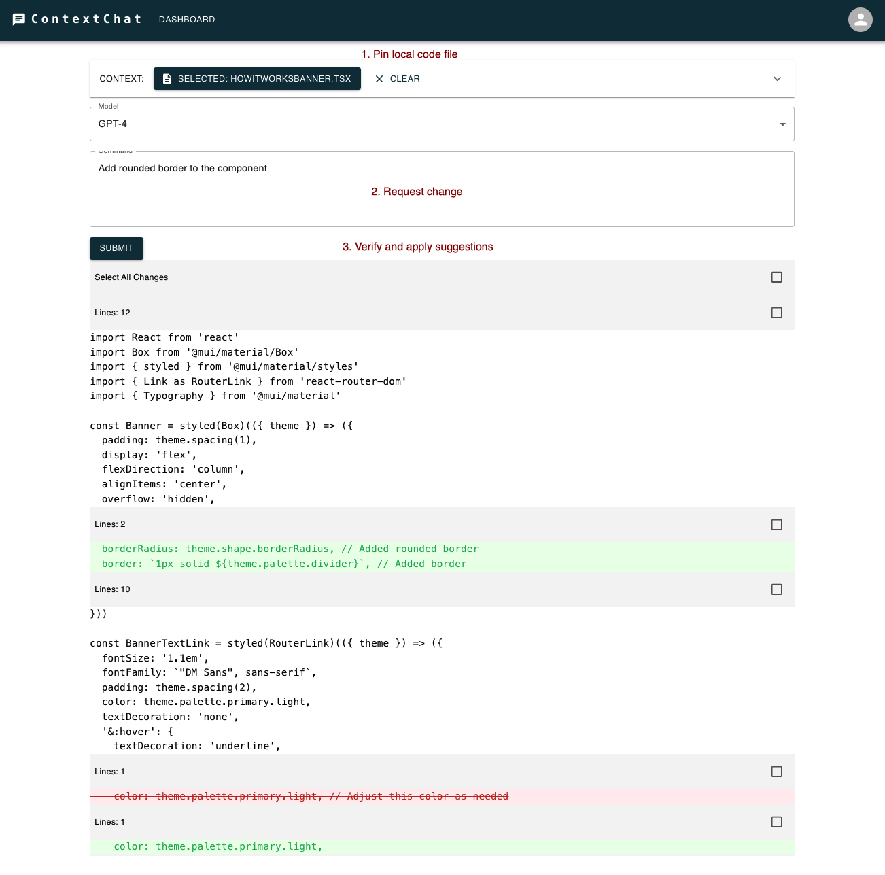

# ContextChat

*POC of a web based code assistant that allows to collaborate with LLM on pinned context.*

- It uses [File System API](https://developer.mozilla.org/en-US/docs/Web/API/File_System_API) to establish a writable handle on a local file which allows to get the latest content of the file and pass it to the LLM with each chat message.

- It uses [React Diff Viewer](https://github.com/securingsincity/react-diff-viewer) to diff the content of the file and highlight the changes made by the LLM and apply those changes to the file.

## Screenshot

## Status
The project was able to proof the concept of achieving binding to a local fill in a web browser settings. As many new tools have appeared since then such as Claude project artifacts, Cursor, etc. the problem that the project aimed to solvecan be solved in a different ways.